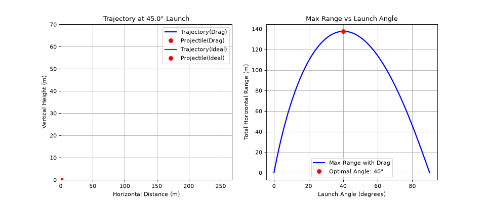

# math
Using modules like numpy and matplotlib to have fun with math

## **Installation:**  
1. **Clone Repository:**  
   ```bash
   git clone [https://github.com/hasezaf/math.git](https://github.com/hasezaf/math.git)
   cd math
2. **Python 3.7 or higher**
3. **Install dependencies (matplotlib and numpy) from requirements file using:**  
   ```bash
   pip install -r requirements.txt
   ```
   
## **Projects:**     
**Projectile motion with and without drag:** Program that simulates the trajectory of a projectile under circumstances (initial velocity, angle and drag coefficient) and produces an animated graph of the simulation using matplotlib and numpy to form equations. Equations implemented are the Newton's laws of motion and Euler's method for drag. Furthermore, it also produces a graph to determine the optimum angle and the optimum range with that angle with drag. (drag coefficient defined by you). Saves gif in CWD but make sure to give the program around 15-30 seconds to run

Run the program using:
```bash
python projectile_motion_with_drag.py
```
**Demo:**  



